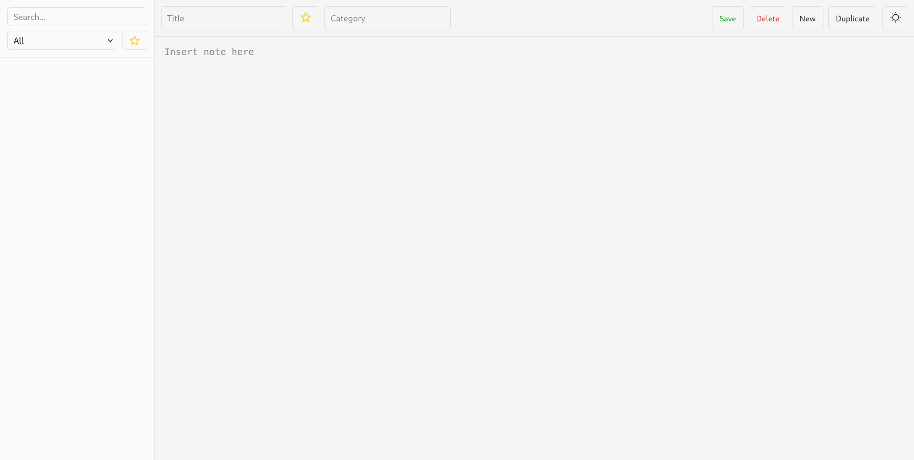
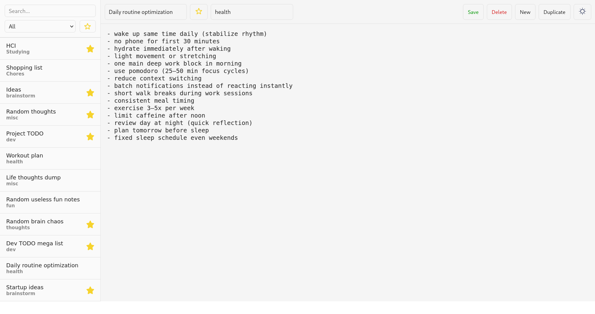
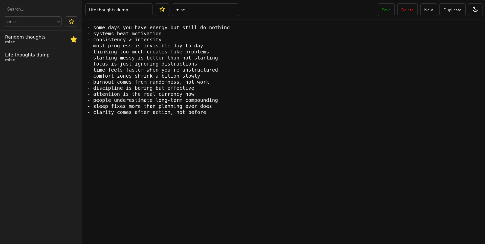
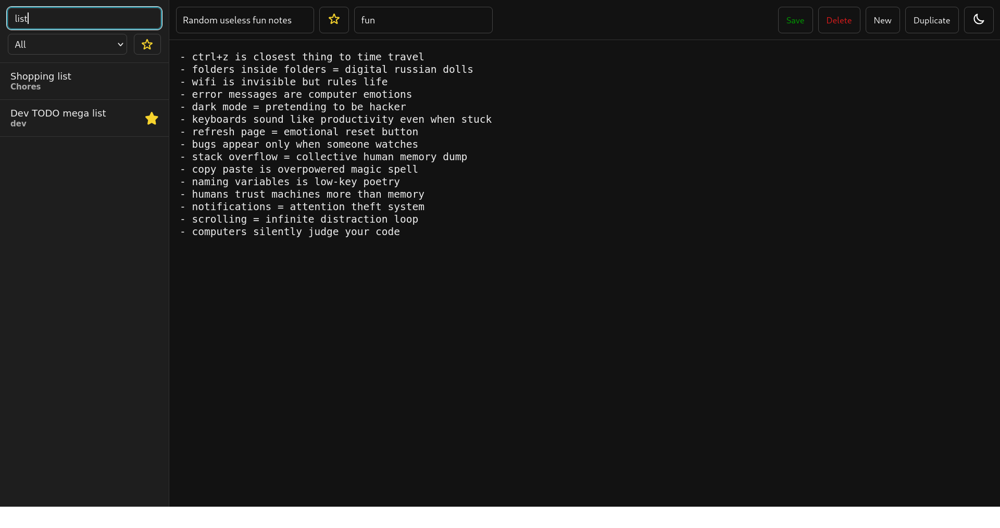
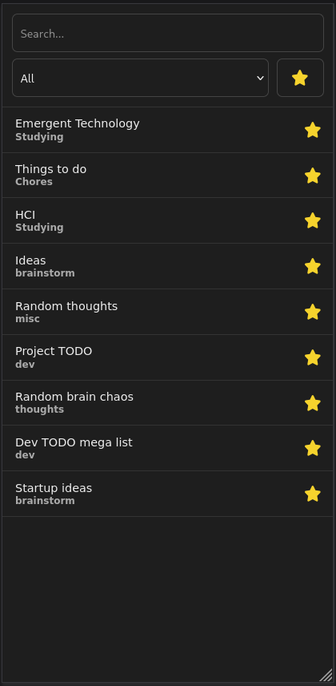
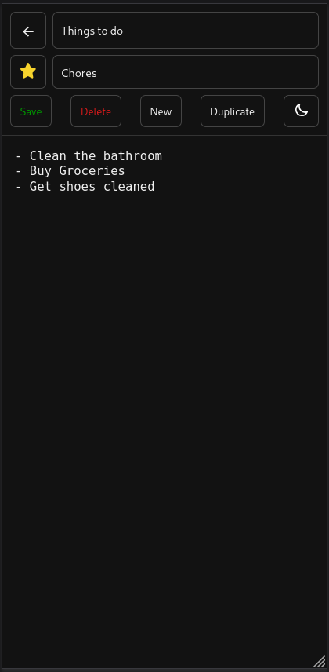

# note-app

## A note-app that is created using MERN tech stack

a MongoDB, Express, React, Node (MERN) javascript project that is utilized for the following functions:

1. Adding / Deleting Notes
2. Categories and Favorites Notes
3. Light & Dark UIs
4. Stored in MongoAtlas
5. Used REST API along with Express and Node.js

## How it works
- Contains 3 components (Search, List, Editor)
- Any updates done to the notes is then updated to the database
- The UI is re-rendered whenever any changes are detected
- Stores UI preferences in localStorage

## Screenshots
### Default Interface


### Main Interface


### Dark Mode


### Search


### Mobile View 1
<p align="center">
  
</p>

### Mobile View 2
<p align="center">
  
</p>

## How to run
1. Clone the repo
2. Run:

```bash
npm install
```

3. Create .env with:

```bash
MONGO_URI=connection_string
```

4. Run:

```bash
node src/server/index.js
```

5. Run:
```bash
npm run dev
```